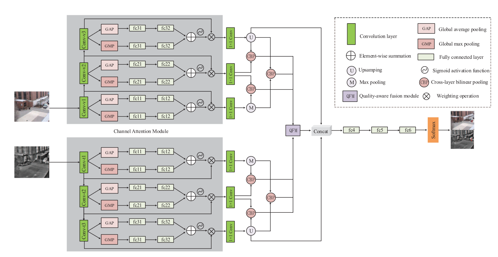
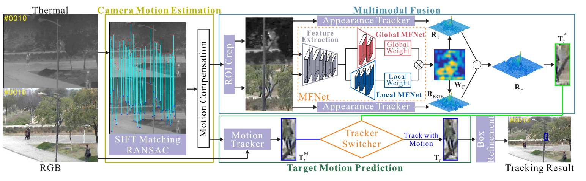
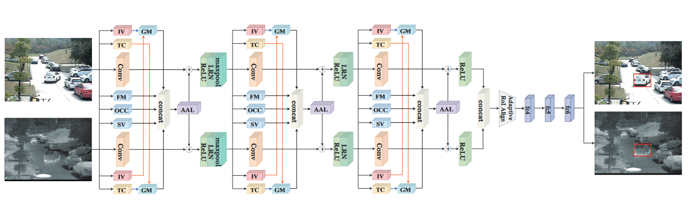
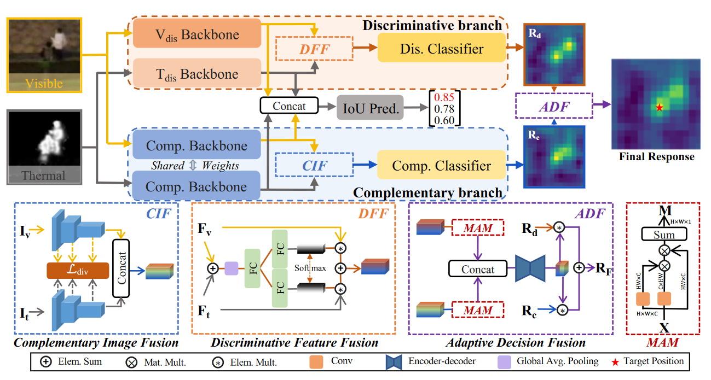
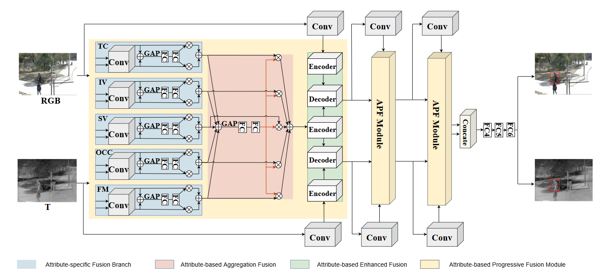
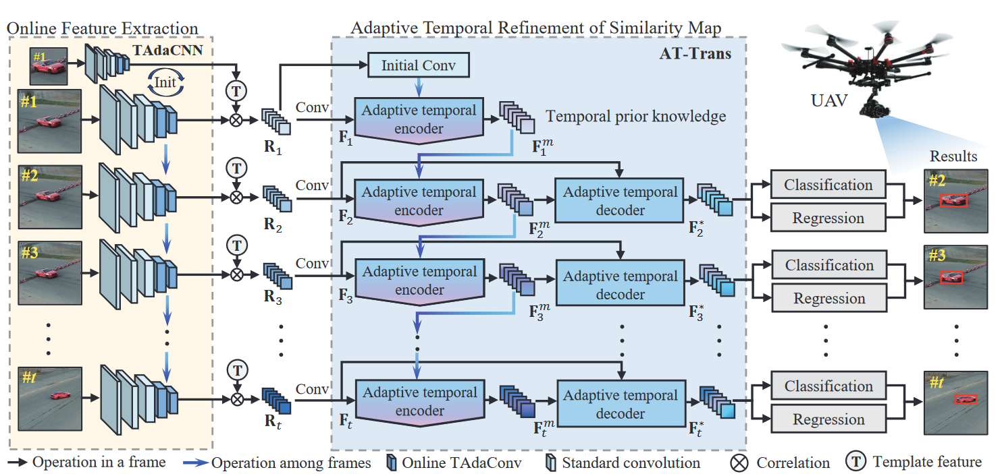
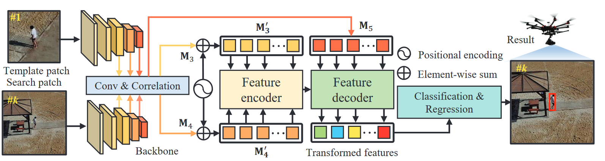

# Multimodal Tracking
This is a Multimodal_tracking repo recording the papers and codes.

## RGB-T Tracking
- Multimodal Cross-Layer Bilinear Pooling for RGBT Tracking (Trans Multimedia 2022)

CBPNet

- Jointly Modeling Motion and Appearance Cues for Robust RGB-T Tracking (Trans on Image Process 2021)

JMMAC

- Challenge-Aware RGBT Tracking (ECCV 2020)

CAT

- Visible-Thermal UAV Tracking: A Large-Scale Benchmark and New Baseline (CVPR 2022)

HMFT

- Attribute-based Progressive Fusion Network for RGBT Tracking (AAAI 2022)

APFNet

## RGB-D Track

## UAV Tracking
- TCTrack: Temporal Contexts for Aerial Tracking (CVPR 2022)

- HiFT: Hierarchical Feature Transformer for Aerial Tracking (ICCV 2021)
