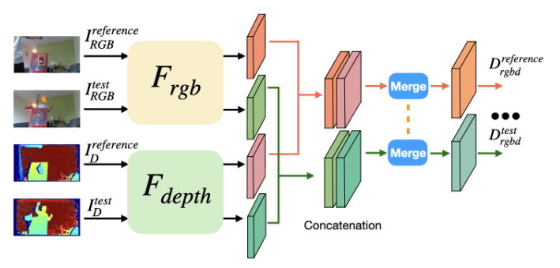
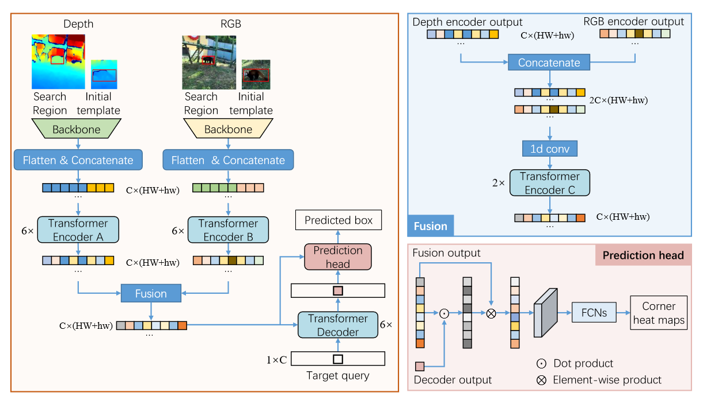
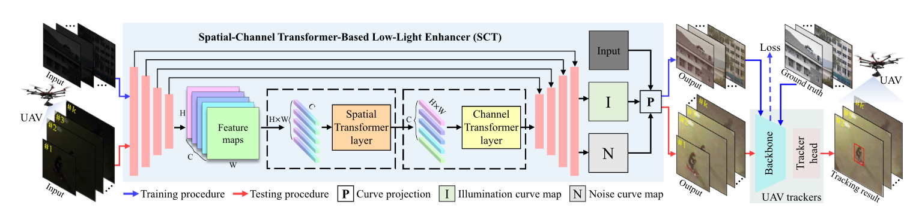

# Multimodal Tracking
This is a Multimodal_tracking repo recording the papers and codes.

## RGB-T Tracking
- Multimodal Cross-Layer Bilinear Pooling for RGBT Tracking (Trans Multimedia 2022)

CBPNet

- Jointly Modeling Motion and Appearance Cues for Robust RGB-T Tracking (Trans on Image Process 2021)

JMMAC

- Challenge-Aware RGBT Tracking (ECCV 2020)

CAT

- Visible-Thermal UAV Tracking: A Large-Scale Benchmark and New Baseline (CVPR 2022)

HMFT

- Attribute-based Progressive Fusion Network for RGBT Tracking (AAAI 2022)

APFNet

## RGB-D Tracking
- Unveiling the power of rgbd tracking (ICCV 2021)

- SPT:RGBD1K: A Large-scale Dataset and Benchmark for RGB-D Object Tracking (arxiv 2022)

## RGB-E Tracking

## UAV Tracking
- TCTrack: Temporal Contexts for Aerial Tracking (CVPR 2022)

- HiFT: Hierarchical Feature Transformer for Aerial Tracking (ICCV 2021)

- Tracker Meets Night: A Transformer Enhancer for UAV Tracking (IEEE ROBOTICS AND AUTOMATION LETTERS 2022)

## Dataset
### RGB-T Dataset
- **GTOT** Learning Collaborative Sparse Representation for Grayscale-Thermal Tracking
- **RGBT234**  RGB-T object tracking: Benchmark and baseline (Pattern Recognition 2019)
- **LasHeR** LasHeR: A Large-Scale High-Diversity Benchmark for RGBT Tracking (Trans Image Processing 2022)
- **VTUAV** Visible-Thermal UAV Tracking: A Large-Scale Benchmark and New Baseline (CVPR 2022)

### RGB-D Dataset
- **Depthtrack** Unveiling the power of rgbd tracking (ICCV 2021)
- **RGBD1K** RGBD1K: A Large-scale Dataset and Benchmark for RGB-D Object Tracking (arxiv 2022)
  

### RGB-E Dataset
