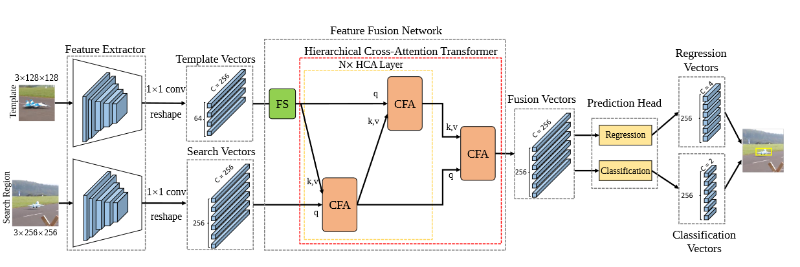
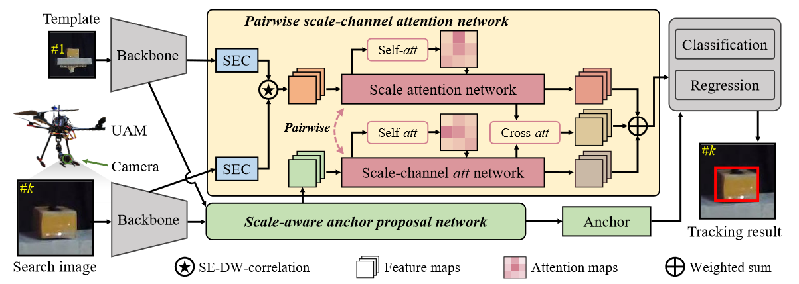

# Multimodal Tracking
This is a Multimodal_tracking repo recording the papers and codes.

## RGB-T Tracking
- Multimodal Cross-Layer Bilinear Pooling for RGBT Tracking (Trans Multimedia 2022)

CBPNet

- Jointly Modeling Motion and Appearance Cues for Robust RGB-T Tracking (Trans on Image Process 2021)

JMMAC

- Challenge-Aware RGBT Tracking (ECCV 2020)

CAT

- Visible-Thermal UAV Tracking: A Large-Scale Benchmark and New Baseline (CVPR 2022)

HMFT

- Attribute-based Progressive Fusion Network for RGBT Tracking (AAAI 2022)

APFNet

## RGB-D Tracking
- Unveiling the power of rgbd tracking (ICCV 2021)

- RGBD1K: A Large-scale Dataset and Benchmark for RGB-D Object Tracking (arxiv 2022)

## RGB-E Tracking
- Object Tracking by Jointly Exploiting Frame and Event Domain (ICCV 2021)
-

## UAV & Lightweight Tracking
- TCTrack: Temporal Contexts for Aerial Tracking (CVPR 2022)

- HiFT: Hierarchical Feature Transformer for Aerial Tracking (ICCV 2021)

- Tracker Meets Night: A Transformer Enhancer for UAV Tracking (IEEE ROBOTICS AND AUTOMATION LETTERS 2022)

- Siamese Transformer Pyramid Networks for Real-Time UAV Tracking (WACV 2022)
  
- Efficient Visual Tracking via Hierarchical Cross-Attention Transformer (arxiv 2022)

- Siamese Object Tracking for Vision-Based UAM Approaching with Pairwise Scale-Channel Attention (arxiv 2022)

## Dataset
### RGB-T Dataset
- **GTOT** Learning Collaborative Sparse Representation for Grayscale-Thermal Tracking
- **RGBT234**  RGB-T object tracking: Benchmark and baseline (Pattern Recognition 2019)
- **LasHeR** LasHeR: A Large-Scale High-Diversity Benchmark for RGBT Tracking [[github]](https://github.com/BUGPLEASEOUT/LasHeR) (Trans Image Processing 2022)
- **VTUAV** Visible-Thermal UAV Tracking: A Large-Scale Benchmark and New Baseline [[github]](https://github.com/zhang-pengyu/DUT-VTUAV) [[dataset]](https://zhang-pengyu.github.io/DUT-VTUAV/) (CVPR 2022)

### RGB-D Dataset
- **CDTB** CDTB: A Color and Depth Visual Object Tracking Dataset and Benchmark (ICCV 2019)
- **STC** Robust Fusion of Color and Depth Data for RGB-D Target Tracking Using Adaptive Range-Invariant Depth Models and Spatio-Temporal Consistency Constraints (Trans on Cybernetics 2018)
- **Depthtrack** Unveiling the power of rgbd tracking [[github]](https://github.com/xiaozai/DeT) (ICCV 2021)
- **RGBD1K** RGBD1K: A Large-scale Dataset and Benchmark for RGB-D Object Tracking (arxiv 2022)

### RGB-E Dataset
- **VisEvent** VisEvent: Reliable Object Tracking via Collaboration of Frame and Event Flows [[github]](https://github.com/wangxiao5791509/VisEvent_SOT_Benchmark) [[dataset]](https://sites.google.com/view/viseventtrack/) (arxiv 2021)
- **FE108** Object Tracking by Jointly Exploiting Frame and Event Domain [[github]](https://github.com/Jee-King/ICCV2021_Event_Frame_Tracking) [[dataset]](https://zhangjiqing.com/dataset/) (ICCV 2021)